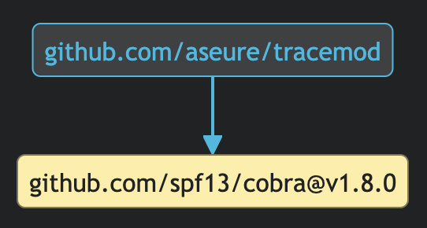

<p align="center">
    <figure>
        
        <figcaption><em>Generated by DALL-E</em></figcaption>
    </figure>
</p>

------
**tracemod** is a self-contained binary which lets you trace dependencies from
Go projects visually.

### 💻 Usage

Generate and display an SVG rendering of all the direct and transitive
dependencies matching `github.com/spf13/cobra`.

```shell
tracemod github.com/spf13/cobra
```



### 📦 Installation

- From GitHub: `go install github.com/aseure/tracemod@latest`

### ✨ Features

#### ♾️  Limit the number of dependency paths

Use the `-m`/`--max-traces` option to limit the maximum number of dependency
paths to generate. This is useful when looking for a dependency included in
many places, such as Protobuf.

#### 🗺️  Choose the graph direction

By default, the direction of the graph is automatically computed to better
represent the dependency tree. However, it is possible to force the rendering
by using the `-d`/`--direction` option to select among the different display
styles:

- `TB` for ⬇️ top-to-bottom
- `BT` for ⬆️ bottom-to-top
- `LR` for ➡️ left-to-right
- `RL` for ⬅️ right-to-left

#### 💎  Look for fixed strings

The search query is by default interpreted as a regular expression. For
convenience, this can be changed by using the `-F`/`--fixed-strings` option
flag to instead look for exact matches.

#### ⏱️  Specify a timeout

When the dependency tree is too big, a timeout can be specified to limit the
execution time of the program, using the `-t`/`--timeout` option. Whenever the
timeout is hit, the resulting dependency graph is still displayed, but keep in
mind that it will only be partial.
